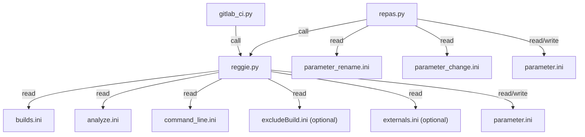

# Table of Contents

- [Reggie2.0](#reggie20-toolbox)
  - [Installation](#installation)
  - [Ruff linter and formatter](#ruff-linter-and-formatter)
  - [Code Coverage](#code-coverage)
  - [Overview](#overview)
  - [Code hierarchy and required *.ini* files](#code-hierarchy-and-required-ini-files)
- [Analyze routines: analyze.ini](#analyze-routines-for-analyzeini)
- [Command line arguments for program execution: command_line.ini](#command-line)
    - [Example](#example)
- [Externals: externals.ini](#externals)
    - [Example](#example-1)
- [Compile flag combinations for c-make in: builds.ini](#builds)
- [Runs](#runs)
    - [Exclude runs directly](#exclude-runs-directly)
    - [Use the same parameter list for multiple parameters in parameter.ini](#use-the-same-parameter-list-for-multiple-parameters-in-parameterini)
    - [Example](#example-2)

# Reggie2.0



Show the available options of the regression checker
```
reggie --help
```

## Installation
Installation can be done either done with the current workflow to keep an editable package for development, i.e.
```
git clone git@XXXXXXXX
cd reggie2.0
pip install -e .
```
Or without editing possibility directly via `pip` and `git` with
```
pip install git+https://github.com/XXXXXXXX
```
Reggie2.0 uses [pre-commit](https://pre-commit.com/) for maintaining code quality. Pre-commit can be installed with
```
pre-commit install
```
## Ruff linter and formatter

Reggie2.0 uses [Ruff](https://docs.astral.sh/ruff/) for code linting and formatting of all .py files to maintain consistent code quality and style. Ruff is a fast Python linter and formatter that combines multiple individual tools like flake8, black, isort, etc.

### Pre-commit Integration

Ruff is integrated with [pre-commit](https://pre-commit.com/) to automatically check and format code before each commit. The configuration is defined in `.pre-commit-config.yaml` and includes:

1. Ruff linter hook
2. Ruff formatter hook

All hooks can be tested with pre-commit before commiting your changes with
```
pre-commit run
```
Note that all pre-commit hooks only run on files that have been staged. The pre-commit hooks can be ignored with the additional flag
```
--no-verify
```


When creating a commit:
1. The linter will display errors immediately
2. The formatter will:
   - Fail if it finds issues
   - Apply automatic fixes
   - Unstage the modified files

After formatter changes:
- Review the applied changes
- Re-stage the files
- Try committing again (formatter should pass if no new changes were made)

Some linter errors can be fixed automatically with
```
ruff check --fix
```
while others require manual corrections.
Note that the flag `--unsafe-fixes` can change the functionality of the code, while `--fix` should keep it.

### Ruff configuration

Ruff's configuration is managed through the `pyproject.toml` file in the project root and specifies linting rules, checks, excludes, etc.

To suppress a violation inline, Ruff uses a `noqa` system similar to Flake8. To ignore an individual violation, add `# noqa: {code}` to the end of the line, like so:
```
# Ignore F841.
x = 1  # noqa: F841
# Ignore E741 and F841.
i = 1  # noqa: E741, F841
# Ignore _all_ violations.
x = 1  # noqa
```

Similar to the linter it is also possible to ignore code blocks for the formatter with
```
# fmt: off
_code_
# fmt: on
```
or a python specific block with
```
if condition: # fmt: skip
```

## Code Coverage
"In software engineering, code coverage, also called test coverage, is a percentage measure of the
degree to which the source code of a program is executed when a particular test suite is run." - [Wikipedia](https://en.wikipedia.org/wiki/Code_coverage)

### gcovr: Coverage of the .f90 code
Reggie2.0 supports code coverage analysis using [gcovr](https://gcovr.com/). To enable code coverage:

1. Compile the executable with the `--coverage` flag in your build configuration.
   For example
    ```
    mkdir build_poisson_code_coverage && cd build_poisson_code_coverage
    cmake .. -DPICLAS_EQNSYSNAME=poisson -DPICLAS_TIMEDISCMETHOD=Leapfrog -DLIBS_USE_PETSC=ON -DPICLAS_CODE_COVERAGE=ON
    make -j
    ```
   This generates additional `.gcno` and `.gcda` files per object file, which track all compiled lines and the number of calls per line.

    **CAUTION**: The `.gcno` and `.gcda` files are **not** deleted by `make clean`! These files must be manually deleted before running new coverage tests,
    as they may be corrupted or retain results from previous runs.

2. Run reggie with the `-o` (or `--coverage`) option to generate the coverage report, for example

    ```
    reggie -e bin/piclas ../regressioncheck/CHE_poisson_p_adaption/Laplace_h_N1_pAdaptionType0/ -o 1
    ```

The `-o` parameter accepts an optional numeric argument to specify the output format: the default generates a `.json` file,
`1` enables additional `.html` output, and `2` produces `.xml` output.

All output files are stored in the `Coverage` directory. Separate reports are generated per build and then combined into a single report across all builds.
This combined report can be inspected as an HTML file at `Coverage/combined_report/html/combined_report.html`.
Other formats such as `.json` or `.xml` are used for combining reports or visualisation on GitLab.

Examples:
```
reggie -b /path/to/basedirectory /path/to/regressiontests -o
reggie /path/to/single/regressiontest -e /path/to/executable -o 1
reggie /path/to/single/regressiontest -e /path/to/executable -o 2
```

### Python coverage.py package: Coverage of the reggie2.0 code itself
It is also possible to generate a report of the reggie tool itself.
For this, each reggie call is wrapped with the [Python coverage tool](https://coverage.readthedocs.io/).
Make sure that the package is installed.
```
python3 -m pip install coverage
```
and then run the coverage tool
```
mkdir -p Coverage/reggie
COVERAGE_REGGIE_DIR="${PWD}/Coverage/reggie"
reggiecov() { coverage run -a --data-file=${COVERAGE_REGGIE_DIR}/.coverage --source=reggie -m reggie.reggie "$@" }
reggiecov -e bin/piclas ../regressioncheck/CHE_poisson_p_adaption/Laplace_h_N1_pAdaptionType0
```

This generates a coverage report of all used lines in the reggie module.
To convert the report to html, run
```
cd Coverage/reggie/ && coverage html && cd ../../
```
which should signal a successful html creation with `Wrote HTML report to htmlcov/index.html`.
The report can be inspected using the `Coverage/reggie/index.html` file.

```
firefox ./Coverage/reggie/htmlcov/index.html
```

## Code hierarchy and required *.ini* files
```
gitlab-ci.py
│   gitlab-ci.yml
│
└───reggie.py
    │   builds.ini
    │   analyze.ini;
    |   command_line.ini;
    |   excludeBuild.ini;
    |   externals.ini (opt);
    │
    └───flexi
    |   parameter_flexi.ini
    |   ...
    └───piclas
    │   parameter_piclas.ini
    │   ...
    └───hopr
        parameter_hopr.ini
        ...
```

# Analyze routines for "analyze.ini"

## Overview

- [Table of Contents](#table-of-contents)
- [Reggie2.0](#reggie20)
  - [Installation](#installation)
  - [Ruff linter and formatter](#ruff-linter-and-formatter)
    - [Pre-commit Integration](#pre-commit-integration)
    - [Ruff configuration](#ruff-configuration)
  - [Code Coverage](#code-coverage)
    - [gcovr: Coverage of the .f90 code](#gcovr-coverage-of-the-f90-code)
    - [Python coverage.py package: Coverage of the reggie2.0 code itself](#python-coveragepy-package-coverage-of-the-reggie20-code-itself)
  - [Code hierarchy and required *.ini* files](#code-hierarchy-and-required-ini-files)
- [Analyze routines for "analyze.ini"](#analyze-routines-for-analyzeini)
  - [Overview](#overview)
  - [Table of Functions](#table-of-functions)
  - [L2 error file](#l2-error-file)
  - [L2 error upper limit](#l2-error-upper-limit)
  - [h-convergence test](#h-convergence-test)
  - [p-convergence test](#p-convergence-test)
  - [h5diff](#h5diff)
  - [h5diff (multiple files)](#h5diff-multiple-files)
    - [Example with `h5diff_one_diff_per_run = F`](#example-with-h5diff_one_diff_per_run--f)
    - [Example with `h5diff_one_diff_per_run = T`](#example-with-h5diff_one_diff_per_run--t)
  - [h5diff (additional options)](#h5diff-additional-options)
    - [Dataset Sorting](#dataset-sorting)
    - [Dataset Re-Shaping](#dataset-re-shaping)
    - [Multiple dataset names](#multiple-dataset-names)
    - [Compare variables](#compare-variables)
  - [vtudiff](#vtudiff)
  - [vtudiff (additional options)](#vtudiff-additional-options)
    - [Compare single array](#compare-single-array)
  - [h5 array bounds check](#h5-array-bounds-check)
  - [Data file line comparison](#data-file-line-comparison)
    - [Example 1 of 4](#example-1-of-4)
    - [Example 2 of 4](#example-2-of-4)
    - [Example 3 of 4](#example-3-of-4)
    - [Example 4 of 4](#example-4-of-4)
  - [integrate data columns](#integrate-data-columns)
  - [compare data column](#compare-data-column)
  - [Compare across commands](#compare-across-commands)
  - [Clean-up files](#clean-up-files)
- [Command Line](#command-line)
    - [Example](#example)
- [Externals](#externals)
    - [Example](#example-1)
- [Builds](#builds)
- [Runs](#runs)
    - [Exclude runs directly](#exclude-runs-directly)
    - [Use the same parameter list for multiple parameters in parameter.ini](#use-the-same-parameter-list-for-multiple-parameters-in-parameterini)
    - [Example](#example-2)

## Table of Functions

The parameters used in `analyze.ini` and example arguments are given in the following table. Note that if you intend to use white spaces in variable names they must be supplied in form of `\s` in the variable name.
Example: `"Initial Timestep"` becomes `"Initial\sTimestep"` (or `"Initial\s Timestep"`) because all white spaces are removed from the variable name automatically.
The intention of a white space must be stated explicitly.

|       **analyze**        | **options**                                        | **values (examples)**                 | **Default values** | **Description**                                                                                                                                                                                                                          |
| :----------------------: | :------------------------------------------------- | :------------------------------------ | :----------------- | :--------------------------------------------------------------------------------------------------------------------------------------------------------------------------------------------------------------------------------------- |
|     L2 error in file     | analyze\_L2\_file                                  | L2error.txt                           | None               | data file containing the L2 errors for comparing with                                                                                                                                                                                    |
|                          | analyze\_L2\_file\_tolerance                       | 6e-2                                  | None               | relative/absolute deviation between two L2 errors (from output and from reference file)                                                                                                                                                  |
|                          | analyze\_L2\_file\_tolerance\_type                 | relative                              | absolute           | relative or absolute comparison                                                                                                                                                                                                          |
|                          | analyze\_L2\_file\_error\_name                     | L\_2\_ERROR                           | L\_2               | string name of the L2 error in the std.out file                                                                                                                                                                                          |
|         L2 error         | analyze\_L2                                        | 1e-5                                  | None               | L2 upper boundary for all nVar. If one L2 error is above the boundary, this test fails                                                                                                                                                   |
|                          | analyze\_L2\_error\_name                           | L\_2\_ERROR                           | L\_2               | string name of the L2 error in the std.out file                                                                                                                                                                                          |
|    h-convergence test    | analyze\_Convtest\_h\_cells                        | 1,2,4,8                               | None               | number of cells (in each direction, or in the direction of the convergence test variable)                                                                                                                                                |
|                          | analyze\_Convtest\_h\_tolerance                    | 0.3                                   | 0.02               | relative deviation from the p+1 convergence rate to the calculated one                                                                                                                                                                   |
|                          | analyze\_Convtest\_h\_rate                         | 1.0                                   | 1.0                | ratio of successful tests versus failed tests regarding the number of nVar                                                                                                                                                               |
|                          | analyze\_Convtest\_h\_error\_name                  | L\_2\_ERROR                           | L\_2               | string name of the L2 error in the std.out file                                                                                                                                                                                          |
|    p-convergence test    | analyze\_Convtest\_p\_rate                         | 0.6                                   | None               | ratio of successful tests versus failed tests regarding the number of nVar                                                                                                                                                               |
|                          | analyze\_Convtest\_p\_percentage                   | 0.5                                   | 0.75               | ratio of increasing EOC samples vs. total number of samples (for the p-convergence, the EOC must increase with p)                                                                                                                        |
|                          | analyze\_Convtest\_p\_error\_name                  | L\_2\_ERROR                           | L\_2               | string name of the L2 error in the std.out file                                                                                                                                                                                          |
|          h5diff          | h5diff\_file                                       | particle\_State\_00.0000.h5           | None               | name of calculated .h5 file (output from current run)                                                                                                                                                                                    |
|                          | h5diff\_reference\_file                            | particle\_State\_00.0000.h5\_ref      | None               | reference .h5 file (must be placed in repository) for comparing with the calculated one                                                                                                                                                  |
|                          | h5diff\_data\_set                                  | DG\_Solution or DG\_Solution\\sField1 | None               | name of dataset for comparing (e.g. DG\_Solution or DG\_Solution vs. Field1 when the datasets in the two files have different names)                                                                                                     |
|                          | h5diff\_tolerance\_value                           | 1.0e-2                                | 1e-5               | relative/absolute deviation between two elements in a .h5 array                                                                                                                                                                          |
|                          | h5diff\_tolerance\_type                            | relative                              | absolute           | relative or absolute comparison                                                                                                                                                                                                          |
|                          | h5diff\_one\_diff\_per\_run                        | True                                  | False              | when multiple reference files are supplied, these can either be used in every run (h5diff_one_diff_per_run=F) or one each run  (h5diff_one_diff_per_run=T)                                                                               |
|                          | h5diff\_sort                                       | True                                  | False              | Sort h5 arrays before comparing them, which circumvents problems when comparing arrays that are written in arbitrary order due to multiple MPI processes writing the dataset (currently only 2-dimensional m x n arrays are implemented) |
|                          | h5diff\_sort\_dim                                  | 1                                     | -1                 | Sorting dimension of a 2-dimensional m x n array (1: sort array by rows, 2: sort array by columns)                                                                                                                                       |
|                          | h5diff\_sort\_var                                  | 0                                     | -1                 | Sorting variable of the specified dimension. The array will be sorted for this variable in ascending order (note that variables start at 0)                                                                                              |
|                          | h5diff\_reshape                                    | True                                  | False              | Re-shape h5 arrays before comparing them, effectively removing rows or columns (for example). This is currently only implemented for 2-dimensional m x n arrays and 3D and 4D (the latter two can only be reduced in the last dimension).|
|                          | h5diff\_reshape\_dim                               | 1                                     | -1                 | Select the dimension, which is to be changed (decreased, note that variables start at 0)                                                                                                                                                 |
|                          | h5diff\_reshape\_value                             | 11                                    | -1                 | Value to which the selected dimension is to be changed (decreased)                                                                                                                                                                       |
|                          | h5diff\_flip                                       | True                                  | False              | Re-shape the h5 array before comparing it with the reference by transposing the array. This is currently only implemented for 2-dimensional m x n arrays.                                                                                |
|                          | h5diff\_max\_differences                           | 15                                    | 0                  | Maximum number of allowed differences that are detected by h5diff for the test to pass without failure                                                                                                                                   |
|                          | h5diff\_var\_attribute                             | VarNamesSurface                       | None               | name of attribute in the h5 file containing the column names of the given dataset                                                                                                                                                        |
|                          | h5diff\_var\_name                                  | Spec001_ImpactNumber                  | None               | name of column containing the data which should be compared                                                                                                                                                                              |
|          vtudiff         | vtudiff\_file                                      | particle\_Solution\_00.0000.vtu       | None               | name of calculated .vtu file (output from current run)                                                                                                                                                                                    |
|                          | vtudiff\_reference\_file                           | particle\_Solution\_00.0000\_ref.vtu  | None               | reference .vtu file (must be placed in repository) for comparing with the calculated one                                                                                                                                                  |
|                          | vtudiff\_relative\_tolerance\_value                | 1.0e-5                                | 1e-2               | relative deviation between two elements in a .vtu array                                                                                                                                                                          |
|                          | vtudiff\_absolute\_tolerance\_value                | 1.0e-8                                | 1e-5               | absolute deviation between two elements in a .vtu array                                                                                                                                                                          |
|                          | vtudiff\_array\_name                               | DG\_Solution or DG\_Solution\\sField1 | None               | name of .vtu array for comparing (e.g. DG\_Solution or DG\_Solution vs. Field1 when the datasets in the two files have different names)                                                                                                     |
|  h5 array bounds check   | check\_hdf5\_file                                  | tildbox_State_01.0000.h5              | None               | name of calculated .h5 file (output from current run)                                                                                                                                                                                    |
|                          | check\_hdf5\_data\_set                             | PartData                              | None               | name of data set for comparing (e.g. DG\_Solution)                                                                                                                                                                                       |
|                          | check\_hdf5\_span                                  | 1                                     | 2                  | Checks elements of a 2-dimensional m x n array (1: check array elements by rows, 2: check array elements by columns)                                                                                                                     |
|                          | check\_hdf5\_dimension                             | 0:2                                   | None               | dimension of data set (note that dimensions start at 0)                                                                                                                                                                                  |
|                          | check\_hdf5\_limits                                | -10.0:10.0                            | None               | bounding interval for all elements in h5 array for all dimensions supplied under check\_hdf5\_dimension                                                                                                                                  |
|      data file line      | compare\_data\_file\_one\_diff\_per\_run           | True                                  | True               | if multiple reference files are supplied, these can either be used in every run or one each run                                                                                                                                          |
|                          | compare\_data\_file\_name                          | Database.csv                          | None               | name of calculated ASCII data file (usually .csv file)                                                                                                                                                                                   |
|                          | compare\_data\_file\_reference                     | Database.csv\_ref                     | None               | name of reference file (must be placed in repository)                                                                                                                                                                                    |
|                          | compare\_data\_file\_tolerance                     | 6e-2                                  | None               | relative/absolute deviation between two elements (in e.g. .csv file)                                                                                                                                                                     |
|                          | compare\_data\_file\_tolerance\_type               | relative                              | absolute           | relative or absolute comparison                                                                                                                                                                                                          |
|                          | compare\_data\_file\_line                          | 50                                    | last               | line number in calculated data file (e.g. .csv file)                                                                                                                                                                                     |
|                          | compare\_data\_file\_delimiter                     | :                                     | ,                  | delimiter symbol, default is comma ',' (note that a comma cannot be supplied in this file as it is a delimiter itself)                                                                                                                   |
|                          | compare\_data\_file\_max\_differences              | 5                                     | 0                  | Maximum number of allowed differences that are detected by comparison with a reference value for the test to pass without failure                                                                                                        |
|  integrate data columns  | integrate\_line\_file                              | Database.csv                          | None               | name of calculated output file (e.g. .csv file)                                                                                                                                                                                          |
|                          | integrate\_line\_delimiter                         | :                                     | ,                  | delimiter symbol, default is comma ',' (note that a comma cannot be supplied in this file as it is a delimiter itself)                                                                                                                   |
|                          | integrate\_line\_columns                           | 0:5                                   | None               | two columns for the values x and y supplied as 'x:y' (Note that columns start at 0)                                                                                                                                                      |
|                          | integrate\_line\_integral_value                    | 44.00                                 | None               | integral value used for comparison                                                                                                                                                                                                       |
|                          | integrate\_line\_tolerance_value                   | 0.8e-2                                | None               | tolerance that is used in comparison                                                                                                                                                                                                     |
|                          | integrate\_line\_tolerance_type                    | relative                              | None               | type of tolerance, either 'absolute' or 'relative'                                                                                                                                                                                       |
|                          | integrate\_line\_option                            | DivideByTimeStep                      | None               | special option, e.g., calculating a rate by dividing the integrated values by the timestep which is used in the values 'x'                                                                                                               |
|                          | integrate\_line\_multiplier                        | 1                                     | 1                  | factor for multiplying the result (in order to acquire a physically meaning value for comparison)                                                                                                                                        |
|                          | integrate\_line\_multiplier                        | 1                                     | 1                  | factor for multiplying the result (in order to acquire a physically meaning value for comparison)                                                                                                                                        |
|   compare data column    | compare\_column\_file                              | PartAnalyze.csv                       | None               | name of calculated output file (e.g. .csv file)                                                                                                                                                                                          |
|                          | compare\_column\_reference\_file                   | Reference.csv                         | None               | name of of the reference file                                                                                                                                                                                                            |
|                          | compare\_column\_delimiter                         | :                                     | ,                  | delimiter symbol, default is comma ',' (note that a comma cannot be supplied in this file as it is a delimiter itself)                                                                                                                   |
|                          | compare\_column\_index                             | 0                                     | None               | column indices for comparison, multiple columns per file are possible (Note that the index of the column start at 0)                                                                                                                     |
|                          | compare\_column\_tolerance_value                   | 0.8e-2                                | None               | tolerance that is used in comparison                                                                                                                                                                                                     |
|                          | compare\_column\_tolerance_type                    | relative                              | None               | type of tolerance, either 'absolute' or 'relative'                                                                                                                                                                                       |
|                          | compare\_column\_multiplier                        | 1                                     | 1                  | factor for multiplying the result (in order to acquire a physically meaning value for comparison)                                                                                                                                        |
| compare across commands  | compare\_across\_commands\_<br />file              | ElemTimeStatistics.csv                | None               | name of calculated output file (e.g. csv)                                                                                                                                                                                                |
|                          | compare\_across\_commands\_<br />column\_delimiter | :                                     | ,                  | delimiter symbol, default is comma ',' (note that a comma cannot be supplied in this file as it is a delimiter itself)                                                                                                                   |
|                          | compare\_across\_commands\_<br />column\_index     | 0                                     | None               | column index for comparison (note that first column has index 0)                                                                                                                                                                         |
|                          | compare\_across\_commands\_<br />line\_number      | 1                                     | last               | line number for comparison (note that first line has number 1)                                                                                                                                                                           |
|                          | compare\_across\_commands\_<br />tolerance\_value  | 0.1                                   | 0.1                | tolerance value for deviation among the values to be compared                                                                                                                                                                            |
|                          | compare\_across\_commands\_<br />tolerance\_type   | absolute                              | relative           | tolerance type to be used in comparison                                                                                                                                                                                                  |
|                          | compare\_across\_commands\_<br />reference         | 1                                     | 0                  | command number for taking reference value (according to numbering cmd_0001, cmd_0002,...) - default value 0 takes average of all calculated values                                                                                       |
| clean-up files after run | clean\_up\_files                                   | *_State_*                             | None               | remove all unwanted files directly after the run is completed. The wild card character is "*"                                                                                                                                            |

## L2 error file
* Compare all L2 errors calculated for all nVar against supplied values in a data file
* relative or absolute comparison possible

Template for copying to **analyze.ini**

```
 ! L2 error from file
analyze_L2_file                = L2error.txt
analyze_L2_file_tolerance      = 1e-2
analyze_L2_file_tolerance_type = relative
```

Note that the errors (in this example in L2error.txt) must be supplied in the following format

```
L_2       :    1.5942413E+09   1.9238600E+09   1.2437159E+10   7.1690941E+01   1.4439652E+02   1.4360107E-01   1.5516452E+09   3.2439672E-02
```

## L2 error upper limit
* Compare all L2 errors calculated for all nVar against an upper boundary *analyze_L2*

Template for copying to **analyze.ini**

```
!L2 error norm
analyze_L2=1e7
```

## h-convergence test
* Determine the rate of convergence versus decreasing the average spacing between two DOF by running multiple different grids
* Requires multiple mesh files

Template for copying to **analyze.ini**

```
! h-convergence test
analyze_Convtest_h_cells=1,2,4,8
analyze_Convtest_h_tolerance=0.3
analyze_Convtest_h_rate=1
```

## p-convergence test
* Determine an increasing rate of convergence by increasing the polynomial degree (for a constant mesh)

Template for copying to **analyze.ini**

```
! p-convergence test
analyze_Convtest_p_rate=0.8
analyze_Convtest_p_percentage=0.75
```

## h5diff
* Compares two arrays from two .h5 files element-by-element either with an absolute or relative difference (when comparing with zero, h5diff automatically uses an absolute comparison).
* Requires h5diff, which is compiled within the HDF5 package (set the corresponding environment variable).

      `export PATH=/opt/hdf5/X.X.XX/bin/:$PATH`
* Requires h5py for checking if the datasets which are to be compared by h5diff are of the same dimensions.

  [http://docs.h5py.org/en/2.5.0/build.html](http://docs.h5py.org/en/2.5.0/build.html)

Template for copying to **analyze.ini**

```
! hdf5 diff
h5diff_file            =          single-particle_State_000.00000005000000000.h5
h5diff_reference_file  = single-particle_reference_State_000.0000000500000000.h5
h5diff_data_set        = DG_Source
h5diff_tolerance_value = 1.0e-2
h5diff_tolerance_type  = relative
```

## h5diff (multiple files)
* Compares multiple arrays from multiple .h5 files element-by-element either with an absolute or relative difference (when comparing with zero, h5diff automatically uses an absolute comparison).
* Requires h5diff, which is compiled within the HDF5 package.

### Example with `h5diff_one_diff_per_run = F`
Each comparison defined in analyze.ini is performed in each run.
The following example considers two runs (e.g. the time step is changed between the runs) and compares two files with two separate reference files in each run, hence, multiple file output can be analyzed.

Template for copying to **analyze.ini**

```
! hdf5 diff
h5diff_file            = sharpSOD_State_0000000.100000000.h5        , sharpSOD_QDS_0000000.100000000.h5
h5diff_reference_file  = reggie_sharpSOD_State_0000000.100000000.h5 , reggie_sharpSOD_QDS_0000000.100000000.h5
h5diff_data_set        = DG_Solution                                , FieldData
h5diff_tolerance_value = 1.0e-12                                    , 1.0e-12
h5diff_tolerance_type  = absolute                                   , absolute
```

### Example with `h5diff_one_diff_per_run = T`
A different comparison is performed in each run, where each column in analyze.ini is only used for one of the runs.
The following example considers 4 runs (the polynomial degree is varied) and in every run only one file is compared with a reference file, which is different for each run.
This can be used when the mesh is varied in each run, e.g., Cartesian and split2hex meshes and the resulting .h5 files are used for comparison.

Template for copying to **analyze.ini**
```
! hdf5 diff
h5diff_one_diff_per_run= T
h5diff_allow_reorder   = T                                                         , T                                                         , T                                                         , T
h5diff_file            = hdg_slab_DielectricGlobal_000.00000000000000000.h5        , hdg_slab_DielectricGlobal_000.00000000000000000.h5        , hdg_slab_DielectricGlobal_000.00000000000000000.h5        , hdg_slab_DielectricGlobal_000.00000000000000000.h5
h5diff_reference_file  = hdg_slab_DielectricGlobal_000.00000000000000000_ref_N3.h5 , hdg_slab_DielectricGlobal_000.00000000000000000_ref_N5.h5 , hdg_slab_DielectricGlobal_000.00000000000000000_ref_N7.h5 , hdg_slab_DielectricGlobal_000.00000000000000000_ref_N9.h5
h5diff_data_set        = DG_Solution                                               , DG_Solution                                               , DG_Solution                                               , DG_Solution
h5diff_tolerance_value = 1.0e-2                                                    , 1.0e-2                                                    , 1.0e-2                                                    , 1.0e-2
h5diff_tolerance_type  = relative                                                  , relative                                                  , relative                                                  , relative
```
## h5diff (additional options)

### Dataset Sorting

* Further options include the pre-sorting of a dataset before the actual comparison via h5diff is
  performed. This circumvents problems when comparing arrays that are written in arbitrary order due to
  multiple MPI processes writing the dataset (currently only 2-dimensional m x n arrays are
  implemented)
* The sorting can be performed for rows `m` by setting `h5diff_sort_dim=1` or columns `n` by `h5diff_sort_dim=2`
* The corresponding variable is selected via `h5diff_sort_var`. Note that variables start at 0 and end at m-1 or n-1 for rows or columns, respectively.

The following example considers an 8 x 4481 array *PartData*, which is to be sorted by the values in
the first row (select the rows via `h5diff_sort_dim=1` and the variable `h5diff_sort_var=0`)

Template for copying to **analyze.ini**
```
! hdf5 diff
h5diff_file             = sphere_PartStateBoundary_000.00000010000000000.h5
h5diff_reference_file   = sphere_PartStateBoundary_000.00000010000000000_ref.h5
h5diff_data_set         = PartData
h5diff_tolerance_value  = 1.0e-2
h5diff_tolerance_type   = relative
h5diff_sort             = T
h5diff_sort_dim         = 1
h5diff_sort_var         = 0
```

### Dataset Re-Shaping
- datasets may be reshaped prior to comparison, e.g., made smaller by decreasing a dimension

The following example considers an 14497 x 12 array *PartData*, which is to be re-shaped to an 14497 x 11 array, effectively
removing the 12th column.

Template for copying to **analyze.ini**
```
! hdf5 diff
h5diff_file             = sphere_PartStateBoundary_000.00000010000000000.h5
h5diff_reference_file   = sphere_PartStateBoundary_000.00000010000000000_ref.h5
h5diff_data_set         = PartData
h5diff_tolerance_value  = 1.0e-2
h5diff_tolerance_type   = relative
h5diff_reshape          = T
h5diff_reshape_dim      = 0
h5diff_reshape_value    = 11
```

### Multiple dataset names
When the datasets in the file and reference differ, simply supply both names. Instead of
```
h5diff_data_set        = DG_Solution
```
simply add the second name and add the "\s" delimiter, because white spaces are always removed by default
```
h5diff_data_set        = DG_Solution\sField1
```
where "DG\_Solution" corresponds to the dataset name in *h5diff_file* and "Field1" to the dataset in *h5diff_reference_file*.

### Compare variables
This option allows for comparison of a single column of the selected dataset to avoid unnecessary computation. Simply provide the name of the attribute of the hdf5 file, which contains all names of the different columns in the dataset and additionally the name of the column, which should be compared.

Both variables also take '_' as placeholder when using more than one analyze to compare all variables.

Template for copying to **analyze.ini**
```
! hdf5 diff
h5diff_file             = sphere_PartStateBoundary_000.00000010000000000.h5      , sphere_PartStateBoundary_2_000.00000010000000000.h5
h5diff_reference_file   = sphere_PartStateBoundary_000.00000010000000000_ref.h5  , sphere_PartStateBoundary_2_000.00000010000000000_ref.h5
h5diff_data_set         = PartData                                               , PartData2
h5diff_tolerance_value  = 1.0e-2                                                 , 1.0e-2
h5diff_tolerance_type   = relative                                               , relative
h5diff_var_attribute    = VarNamesSurface                                        , _
h5diff_var_name         = Spec001_ImpactNumber                                   , _
```

## vtudiff

* Compares the point, field and cell data arrays (if not empty) of two .vtu files for each array element-by-element either with an absolute and/or relative difference (depending on which tolerance values are given - if no tolerance is given both default values are used).
* Requires vtk for reading-in data to python.

  [https://pypi.org/project/vtk/](https://pypi.org/project/vtk/)

Note that piclas2vtk needs to be set as external, since otherwise no .vtu file is created for comparison.
Template for copying to **analyze.ini**

```
! vtu diff
vtudiff_file                       = single-particle_State_000.00000005000000000.h5
vtudiff_reference_file             = single-particle_reference_State_000.0000000500000000.h5
vtudiff_relative_tolerance_value   = 1.0e-2
vtudiff_absolute_tolerance_value   = 1.0
```

## vtudiff (additional options)

### Compare single array

For comparison of only one array simply add the array name with
```
vtudiff_array_name                 = DG_Solution
```
,where "DG\_Solution" is the array name in the .vtu file. This variable takes also '_' as placeholder, when using more than one analyze to compare all arrays.

Template for copying to **analyze.ini**

```
! vtu diff
vtudiff_file                       = single-particle_State_000.00000005000000000.h5           , single-particle_State_2_000.00000005000000000.h5
vtudiff_reference_file             = single-particle_reference_State_000.0000000500000000.h5  , single-particle_reference_State_2_000.0000000500000000.h5
vtudiff_relative_tolerance_value   = 1.0e-2                                                   , 1.0e-2
vtudiff_absolute_tolerance_value   = 1.0                                                      , 1.0
vtudiff_array_name                 = DG_Solution                                              , _
```

## h5 array bounds check
* Check if all elements of a h5 array are within a supplied interval
* Requires *h5py* python module (analyze will fail if the module cannot be found)

Template for copying to **analyze.ini**

```
! check if particles are outside of domain at tEnd
check_hdf5_file        = tildbox_State_001.00000000000000000.h5
check_hdf5_data_set    = PartData
check_hdf5_span        = 2 ! 1: check array elements by rows, 2: check array elements by columns
check_hdf5_dimension   = 0:2
check_hdf5_limits      = -10.0:10.0
```

## Data file line comparison
* Compare a single line in, e.g., a .csv file element-by-elements
* The data is delimited by a comma on default but can be changed by setting "compare\_data\_file\_delimiter = :" (when, e.g., ":" is to be used as the delimiter)
* relative of absolute comparison
* Possibility to perform one comparison per run (e.g. supply 10 data and reference files for 10 different runs), default is true

### Example 1 of 4
Template for copying to **analyze.ini**

```
! compare the last row in Database.csv with a reference file
compare_data_file_name      = Database.csv
compare_data_file_reference = Database_reference.csv
compare_data_file_tolerance = 2.0
compare_data_file_tolerance_type = relative
compare_data_file_one_diff_per_run = T
```

Note that a comma is the default delimiter symbol for reading the data from the supplied file. The variable "compare\_data\_file\_delimiter" cannot be set as custom delimiter symbol "," because the comma is used for splitting the keywords in analyze.ini. However, other symbols can be supplied using "compare\_data\_file\_delimiter" instead of a comma.


### Example 2 of 4

When different runs produce different output (e.g. changing the initial conditions, here, the temperature is varied), multiple reference files can be supplied. The following example produces the same output file (Database.csv) but compares with different reference files (Database\_TX000K\_ref.csv).

```
! compare the last row in Database.csv with a reference file
compare_data_file_name      = Database.csv
compare_data_file_reference = Database_T1000K_ref.csv, Database_T2000K_ref.csv, Database_T3000K_ref.csv, Database_T4000K_ref.csv, Database_T5000K_ref.csv
compare_data_file_tolerance = 2.0
compare_data_file_tolerance_type = relative
```
### Example 3 of 4

Additionally, multiple output files (Database\_TX000K.csv) can be supplied in combination with multiple reference files (Database\_TX000K\_ref.csv). See the following example.

```
! compare the last row in Database.csv with a reference file
compare_data_file_name      = Database_T1000K.csv, Database_T2000K.csv, Database_T3000K.csv, Database_T4000K.csv, Database_T5000K.csv
compare_data_file_reference = Database_T1000K_ref.csv, Database_T2000K_ref.csv, Database_T3000K_ref.csv, Database_T4000K_ref.csv, Database_T5000K_ref.csv
compare_data_file_tolerance = 2.0
compare_data_file_tolerance_type = relative
```

Note that for this example, the number of supplied output files, reference files and runs must be the same.

### Example 4 of 4

Additionally, the tolerance type and value can be altered.

```
! compare the last row in Database.csv with a reference file
compare_data_file_name           = Database_T1000K.csv, Database_T2000K.csv, Database_T3000K.csv, Database_T4000K.csv, Database_T5000K.csv
compare_data_file_reference      = Database_T1000K_ref.csv, Database_T2000K_ref.csv, Database_T3000K_ref.csv, Database_T4000K_ref.csv, Database_T5000K_ref.csv
compare_data_file_tolerance      = 1e-2    , 5e-2    , 1e-10    , 1e-10
compare_data_file_tolerance_type = relative, relative, absolute, absolute
```

Note that for this example, the number of all varied parameters must be the same (in this case 4) otherwise it will not work.

## integrate data columns
* Integrate the data in a column over another column, e.g., x:y in a data file as integral(y(x), x, x(1), x(end)) via the trapezoid rule
* The data is delimited by a comma on default but can be changed by setting "integrate\_line\_delimiter = :" (when, e.g., ":" is to be used as the delimiter)
* special options are available for calculating, e.g., rates (something per second)

Template for copying to **analyze.ini**

```
! ===================================================================================================================
! integrate columns x:y in a data file as integral(y(x), x, x(1), x(end))
! check the emission current of electrons: Current = Q*MPF*q/delta_t_database = 44 A
! ===================================================================================================================
! with   Q = integrate nPartIn(t) from t=0 to t=3E-11 = 4.500111958051274e-10 for p=9 (integrate nPartIN over time)
!      MPF = 1e6
!        q = 1.6022e-19 (charge of one electron)
!       dt = ? (depends on polynomial degree and mesh)
! ===================================================================================================================
! for p = 9: 551 timesteps  -->  0.44769549409291E-09*IntegrateLineMultiplier = 44 A
integrate_line_file            = Database.csv          ! data file name
integrate_line_columns         = 0:5                   ! columns x:y
integrate_line_integral_value  = 44.00                 ! Ampere
integrate_line_tolerance_value = 0.8e-2                ! tolerance
integrate_line_tolerance_type  = relative              ! absolute or relative comparison
integrate_line_option          = DivideByTimeStep      ! the first column in Database.csv is used for this option
integrate_line_multiplier      = 5.340588433333334e-03 ! = MPF*q/tend = 1e6*1.60217653E-19/3E-11
```

Note that a comma is the default delimiter symbol for reading the data from the supplied file. The variable "integrate\_line\_delimiter" cannot be set as custom delimiter symbol "," because the comma is used for splitting the keywords in analyze.ini. However, other symbols can be supplied using "integrate\_line\_delimiter" instead of a comma.

## compare data column
* compares the data in a column with a reference file
* The data is delimited by a comma on default but can be changed by setting "compare\_column\_delimiter = :" (when, e.g., ":" is to be used as the delimiter)
* Comparison of several columns is possible by providing a list of the column indices
* If only a single column (e.g. from a large PartAnalyze.csv) is compared, it is possible to provide a reference file, which only contains a single column to reduce its size
* Possibility to perform one comparison per run (e.g. supply 10 data and reference files for 10 different runs), default is true
* Possibility to perform one comparison per restart file, default is false. Overwrites the one comparison per run parameter above, as the command line runs are one level above

Template for copying to **analyze.ini**

```
! compare columns in a data file
compare_column_file                       = PartAnalyze.csv ! data file name
compare_column_reference_file             = reference.csv   ! reference data file name
compare_column_index                      = 0,1             ! columns index (starts at 0)
compare_column_tolerance_value            = 0.8e-2          ! tolerance
compare_column_tolerance_type             = relative        ! absolute or relative comparison
compare_column_multiplier                 = 5e-3            ! fixed factor
compare_column_one_diff_per_run           = T
compare_column_one_diff_per_restart_file  = F
```

Note that a comma is the default delimiter symbol for reading the data from the supplied file. The variable "compare\_column\_delimiter" cannot be set as custom delimiter symbol "," because the comma is used for splitting the keywords in analyze.ini. However, other symbols can be supplied using "compare\_column\_delimiter" instead of a comma.

## Compare across commands
* **Description:** compare data from corresponding runs of different commands, e.g. `cmd_*/run_0001` (= `cmd_0001/run_0001` vs. `cmd_0002/run_0001` vs. `cmd_0003/run_0001` vs. ...), `cmd_*/run_0002`, `cmd_*/run_0003`, etc.
* **Purpose:** allows to investigate e.g. the parallel efficiency in a strong scaling test, if the different command directories originate from an increasing number of MPI threads (command\_line.ini: `MPI=2,4,6,...`) and the PID is written to the csv-file
* data to be compared is a singular value per run, written to a csv-file and specified through row number (first line = 1) and column index (first column = 0)
* two referencing types are supported, specified through `compare_across_commands_reference`:
  * a value &ge; 1 is interpreted as command index (cf. directory names `cmd_0001`, `cmd_0002`, etc.), e.g. the value 1 would compare all data against that of the first command
  * the value 0 takes the average (arithmetic mean) of all extracted data as reference
* **Caution:** The default delimiter symbol for reading the data from the supplied csv-file is a comma. The variable `compare_across_commands_column_delimiter` cannot be set to character "," because the comma is used for splitting the keywords in analyze.ini. Any other delimiter symbol, however, is acceptable.

Template for copying to **analyze.ini**
```
compare_across_commands_file            = ElemTimeStatistics.csv    ! name of output file
compare_across_commands_column_index    = 5                         ! column index (starts at 0)
compare_across_commands_line_number     = 3                         ! line number (starts at 1)
compare_across_commands_tolerance_value = 0.2                       ! tolerance
compare_across_commands_tolerance_type  = relative                  ! absolute or relative comparison
compare_across_commands_reference       = 1                         ! command number for taking reference value (1,2,...), or 0 for average

```
Make sure to provide a file **command_line.ini** with multiple commands, e.g. for a strong scaling test
```
MPI=2,4,6,8

```

## Clean-up files
* remove all unwanted files directly after the run is completed. The wild card character is "*"

Template for copying to **analyze.ini**

```
clean_up_files = *_State_*, *.csv, *.dat
```


# Command Line

parameters used in `command_line.ini` and example arguments

|   **function**    | **options**   | **values**                 | **Default values** | **Description**                                                                                         |
| :---------------: | :------------ | :------------------------- | :----------------- | :------------------------------------------------------------------------------------------------------ |
|      mpirun       | MPI           | 1,2,4,8                    | None               | number of MPI threads with which the runs are repeated                                                  |
|  additional info  | cmd\_suffix   | DSMC.ini                   | None               | additional information that is appended to the command line argument that is used for running a program |
| restart from file | restart\_file | My_State_000.0000005123.h5 | None               | supply the name of a state file from which all simulations are to be re-started                         |
| link to database  | database      | SpeciesDatabase.h5         | None               | supply the name of a database file and its relative path (e.g. ../../../SpeciesDatabase.h5)             |
link to cVAE scattering model  | cvae_scattering      |cVAE_VLEO_Al2O3.h5         | None               | supply the name of a cVAE file and its relative path (e.g. ../../../cVAE_VLEO_Al2O3.h5)             |


### Example
* run multiple different MPI threads
* use additional parameter file *DSMC.ini*

Template for copying to `command_line.ini`

```
! command line parameters
MPI=2
cmd\_suffix=DSMC.ini
database = ../../../SpeciesDatabase.h5
```

# Externals

parameters used in `externals.ini`

|                      **function**                      | **options**       | **values**              | **Default values** | **Description**                                                                                                                                                 |
| :----------------------------------------------------: | :---------------- | :---------------------- | :----------------- | :-------------------------------------------------------------------------------------------------------------------------------------------------------------- |
|                         mpirun                         | MPI               | 1,2,4,8                 | None               | number of MPI threads with which the runs are repeated                                                                                                          |
|         name of external binary in bin folder          | externalbinary    | hopr                    | None               | supply the external binary name (the binary is assumed to lie in each "build/bin/" directory                                                                    |
| directory of ini-files or ini-file for external binary | externaldirectory | hopr                    | None               | supply the relative path (starting from each example folder) to the directory of the parameterfiles or directly the parameterfiles name for the external binary |
|           runtime of external (pre or post)            | externalruntime   | pre,post                | None               | supply the runtime of the external binary and its parameterfiles as pre- or postprocessing                                                                      |
|                 Pre-execution command                  | cmd\_pre\_execute | ln\s-s\s../cube_mesh.h5 | None               | Run additional script before external in executed (e.g. create an symbolic link)                                                                                |

### Example
* supply two external binaries: hopr and posti
* supply two directories with parameter files for each external tool
* different run times for hopr and posti
* (optional: run different MPI threads with hopr and posti, see above)

Template for copying to `externals.ini`

```
! external parameters
externalbinary    = hopr,posti
externaldirectory = hopr,posti
externalruntime   = pre,post
MPI               = 1,2

! do not mix multiple definitions for binary, directory and runtime
nocrosscombination:externalbinary,externaldirectory,externalruntime,MPI
```

To execute the hopr.ini directly in the test folder

```
MPI               = 1
externalbinary    = ./hopr/build/bin/hopr
externaldirectory = hopr.ini
externalruntime   = pre
```


# Builds

parameters used in `builds.ini` and example arguments

|     **function**     | **options**        | **values**                                       | **Default values** | **Description**                                                       |
| :------------------: | :----------------- | :----------------------------------------------- | :----------------- | :-------------------------------------------------------------------- |
|  program to execute  | binary             | ./bin/flexi                                      | None               | set the relative binary path in build directory                       |
|    compile flags     | CMAKE\_BUILD\_TYPE | DEBUG                                            | None               | set compile flags to the corresponding settings                       |
| exclude combinations | EXCLUDE:           | FLEXI\_VISCOSITY=sutherland,FLEXI\_PARABOLIC=OFF | None               | exclude specific combinations of compile flags, these will be skipped |


# Runs

### Exclude runs directly

In order to exclude runs see the following example
```
! =============================================================================== !
! Species1 - CH4
! =============================================================================== !
Part-Species1-MWTemperatureIC=1000,4000
Part-Species1-TempVib=2000,3000

! exclude combinations
EXCLUDE:Part-Species1-MWTemperatureIC=1000,Part-Species1-TempVib=3000
```

### Use the same parameter list for multiple parameters in parameter.ini

In order to exclude runs see the following example in which 10 runs are performed, but the parameters are exchanged parallely. Modify the `parameter.ini` file.
```
! =============================================================================== !
! Species1 - CH4
! =============================================================================== !
Part-Species1-MWTemperatureIC=crosscombinations
Part-Species1-TempVib=crosscombinations
Part-Species1-TempRot=crosscombinations
Part-Species1-TempElec=crosscombinations
! =============================================================================== !
! Species2 - CH3
! =============================================================================== !
Part-Species2-MWTemperatureIC=crosscombinations
Part-Species2-TempVib=crosscombinations
Part-Species2-TempRot=crosscombinations
Part-Species2-TempElec=crosscombinations
! =============================================================================== !
! Species3 - H2
! =============================================================================== !

Part-Species3-MWTemperatureIC=crosscombinations
Part-Species3-TempVib=crosscombinations
Part-Species3-TempRot=crosscombinations
Part-Species3-TempElec=crosscombinations
! =============================================================================== !
! Species4 - H
! =============================================================================== !
Part-Species4-MWTemperatureIC=crosscombinations
Part-Species4-TempElec=crosscombinations

crosscombinations=1000,2000,3000,4000,5000,6000,7000,8000,9000,10000
```


### Example

Template for copying to `builds.ini`

```
! relative binary path in build directory
binary=./bin/flexi

! fixed compiler flags
CMAKE_BUILD_TYPE=DEBUG
FLEXI_BUILD_HDF5=OFF
FLEXI_PAPI=OFF
FLEXI_POLYNOMIAL_DEGREE=N
FLEXI_MKL=OFF
FLEXI_SPLIT_DG=OFF

! include combinations
FLEXI_2D=OFF,ON
FLEXI_EQNSYSNAME=navierstokes,linearscalaradvection
FLEXI_LIFTING=br1,br2
FLEXI_MPI=ON!,OFF
FLEXI_NODETYPE=GAUSS,GAUSS-LOBATTO
FLEXI_PARABOLIC=ON,OFF
FLEXI_VISCOSITY=constant,sutherland,powerlaw
FLEXI_FV=ON,OFF
FLEXI_FV_RECONSTRUCTION=ON,OFF
FLEXI_GCL=ON,OFF

! exclude combinations
EXCLUDE:FLEXI_VISCOSITY=sutherland,FLEXI_PARABOLIC=OFF
EXCLUDE:FLEXI_VISCOSITY=powerlaw,FLEXI_PARABOLIC=OFF
EXCLUDE:FLEXI_VISCOSITY=sutherland,FLEXI_EQNSYSNAME=linearscalaradvection
EXCLUDE:FLEXI_VISCOSITY=powerlaw,FLEXI_EQNSYSNAME=linearscalaradvection
EXCLUDE:FLEXI_LIFTING=br2,FLEXI_EQNSYSNAME=linearscalaradvection
EXCLUDE:FLEXI_FV=ON,FLEXI_FV_RECONSTRUCTION=OFF,FLEXI_PARABOLIC=ON
EXCLUDE:FLEXI_FV=OFF,FLEXI_FV_RECONSTRUCTION=ON
EXCLUDE:FLEXI_GCL=ON,FLEXI_FV=ON ! Not yet implemented
EXCLUDE:FLEXI_NODETYPE=GAUSS-LOBATTO,FLEXI_VISCOSITY=sutherland
EXCLUDE:FLEXI_NODETYPE=GAUSS-LOBATTO,FLEXI_VISCOSITY=powerlaw
EXCLUDE:FLEXI_LIFTING=br2,FLEXI_VISCOSITY=sutherland
EXCLUDE:FLEXI_LIFTING=br2,FLEXI_VISCOSITY=powerlaw
```
