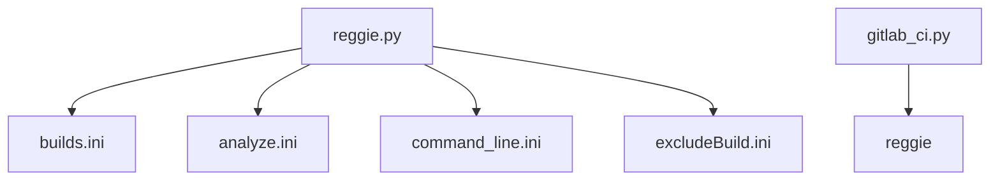

# Reggie2.0 toolbox



Try typing the following
```
python reggie.py --help
```

```
python gitlab-ci.py --help
```

## Overview
Zollernblick slides [RegressionCheck2.0.pdf](/uploads/7a6718bc26615653cdd32116d968b969/RegressionCheck2.0.pdf)
 * [General file and directory hierarchy in Reggie2.0](#code-hierarchy-and-required-ini-files)
 * [Analyze routines for post-processing in **analyze.ini**](#analyze-routines-for-analyzeini)
 * [Command line arguments for program execution in **command_line.ini**](#command-line)
 * [Compile flag combinations for c-make in **builds.ini**](#builds)
 * [Exclude runs in **parameter.ini**](#runs)


## Code hierarchy and required *.ini* files
```
gitlab-ci.py
│   gitlab-ci.yml
│
└───reggie.py
    │   builds.ini
    │   analyze.ini;
    |   command_line.ini;
    |   excludeBuild.ini;
    │
    └───flexi
    |   parameter_flexi.ini
    |   ...
    └───boltzplatz
    │   parameter_boltzplatz.ini
    │   ...
    └───hopr
        parameter_hopr.ini
        ...
```


# Analyze routines for "analyze.ini"
  
1. [L2 error file](#l2-error-file)
1. [L2 error upper limit](#l2-error-upper-limit)
1. [h-convergence test](#h-convergence-test)
1. [p-convergence test](#p-convergence-test)
1. [h5diff](#h5diff)
    1. [h5diff (multiple files)](#h5diff-multiple-files)
1. [h5 array bounds check](#h5-array-bounds-check)
1. [Data file line comparison](#data-file-line-comparison)
1. [integrate data columns](#integrate-data-columns)
1. [Clean-up files after each run](#clean-up-files)


The parameters used in `analyze.ini` and example arguments are given in the following table. Note that if you intend to use whitespaces in variable names they must be supplied in form of `\s` in the variable name. 
Example: `"Initial Timestep"` becomes `"Initial\sTimestep"` (or `"Initial\s Timestep"`) because all whitespaces are removed from the variable name automatically. 
The intention of a whitespace must be stated explcitly. 

|**analyze**               | **options**                          | **values (examples)**                                 | **Default values**               | **Description**           
|:------------------------:|:-------------------------------------|:------------------------------------------------------|:---------------------------------|:---------------------------------------------------------------------------------------------------------------------------|
|L2 error                  | analyze\_L2\_file                    | L2error.txt                                           | None                             | data file containing the L2 errors for comparing with                                                                      |
|                          | analyze\_L2\_file\_tolerance         | 6e-2                                                  | None                             | relative/absolute deviation between two L2 errors (from output and from reference file)                                    |
|                          | analyze\_L2\_file\_tolerance\_type   | relative                                              | absolute                         | relative or absolute comparison                                                                                            |
|                          | analyze\_L2\_file\_error\_name       | L\_2\_ERROR                                           | L\_2                             | string name of the L2 error in the std.out file                                                                            |
|L2 error                  | analyze\_L2                          | 1e-5                                                  | None                             | L2 upper boundary for all nVar. If one L2 error is above the boundary, this test fails                                     |
|                          | analyze\_L2\_error\_name             | L\_2\_ERROR                                           | L\_2                             | string name of the L2 error in the std.out file                                                                            |
|h-convergence test        | analyze\_Convtest\_h\_cells          | 1,2,4,8                                               | None                             | number of cells (in each direction, or in the direction of the convergence test variable)                                  |
|                          | analyze\_Convtest\_h\_tolerance      | 0.3                                                   | 0.02                             | relative deviation from the p+1 convergence rate to the calculated one                                                     |
|                          | analyze\_Convtest\_h\_rate           | 1.0                                                   | 1.0                              | ratio of successful tests versus failed tests regarding the number of nVar                                                 |
|                          | analyze\_Convtest\_h\_error\_name    | L\_2\_ERROR                                           | L\_2                             | string name of the L2 error in the std.out file                                                                            |
|p-convergence test        | analyze\_Convtest\_p\_rate           | 0.6                                                   | None                             | ratio of successful tests versus failed tests regarding the number of nVar                                                 |
|                          | analyze\_Convtest\_p\_percentage     | 0.5                                                   | 0.75                             | ratio of increasing EOC samples vs. total number of samples (for the p-convergence, the EOC must increase with p)          |
|                          | analyze\_Convtest\_p\_error\_name    | L\_2\_ERROR                                           | L\_2                             | string name of the L2 error in the std.out file                                                                            |
|h5diff                    | h5diff\_file                         | single-particle\_State\_000.00000000000000000.h5      | None                             | name of calculated .h5 file (output from current run)                                                                      |
|                          | h5diff\_reference\_file              | single-particle\_State\_000.00000000000000000.h5\_ref | None                             | reference .h5 file (must be placed in repository) for comparing with the calculated one                                    |
|                          | h5diff\_data\_set                    | DG\_Solution                                          | None                             | name of data set for comparing (e.g. DG\_Solution)                                                                         |
|                          | h5diff\_tolerance\_value             | 1.0e-2                                                | 1e-5                             | relative/absolute deviation between two elements in a .h5 array                                                            |
|                          | h5diff\_tolerance\_type              | relative                                              | absolute                         | relative or absolute comparison                                                                                            |
|                          | h5diff\_one\_diff\_per\_run          | True                                                  | False                            | if multiple reference files are supplied, these can either be used in every run or one each run                            |
|h5 array bounds check     | check\_hdf5\_file                    | tildbox_State_001.00000000000000000.h5                | None                             | name of calculated .h5 file (output from current run)                                                                      |
|                          | check\_hdf5\_data\_set               | PartData                                              | None                             | name of data set for comparing (e.g. DG\_Solution)                                                                         |
|                          | check\_hdf5\_dimension               | 0:2                                                   | None                             | dimension of data set ( note that dimensions start at 0)                                                                   |
|                          | check\_hdf5\_limits                  | -10.0:10.0                                            | None                             | bounding interval for all elements in h5 array for all dimensions supplied under check\_hdf5\_dimension                    |
|data file line            | compare\_data\_file\_name            | Database.csv                                          | None                             | name of calculated ASCII data file (usually .csv file)                                                                     |
|                          | compare\_data\_file\_reference       | Database.csv\_ref                                     | None                             | name of reference file (must be placed in repository)                                                                      |
|                          | compare\_data\_file\_tolerance       | 6e-2                                                  | None                             | relative/absolute deviation between two elements (in e.g. .csv file)                                                       |
|                          | compare\_data\_file\_tolerance\_type | relative                                              | absolute                         | relative or absolute comparison                                                                                            |
|                          | compare\_data\_file\_line            | 50                                                    | last                             | line number in calculated data file (e.g. .csv file)                                                                       |
|                          | compare\_data\_file\_delimiter       | :                                                     | ,                                | delimiter symbol, default is comma ',' (note that a comma cannot be supplied in this file as it is a delimiter itself)     |
|integrate data columns    | integrate\_line\_file                | Database.csv                                          | None                             | name of calculated output file (e.g. .csv file)                                                                            |
|                          | integrate\_line\_delimiter           | :                                                     | ,                                | delimiter symbol, default is comma ',' (note that a comma cannot be supplied in this file as it is a delimiter itself)     |
|                          | integrate\_line\_columns             | 0:5                                                   | None                             | two columns for the values x and y supplied as 'x:y' (Note that columns start at 0)                                        |
|                          | integrate\_line\_integral_value      | 44.00                                                 | None                             | integral value used for comparison                                                                                         |
|                          | integrate\_line\_tolerance_value     | 0.8e-2                                                | None                             | tolerance that is used in comparison                                                                                       |
|                          | integrate\_line\_tolerance_type      | relative                                              | None                             | type of tolerance, either 'absolute' or 'relative'                                                                         |
|                          | integrate\_line\_option              | DivideByTimeStep                                      | None                             | special option, e.g., calculating a rate by dividing the integrated values by the timestep which is used in the values 'x' |
|                          | integrate\_line\_multiplier          | 1                                                     | 1                                | factor for multiplying the result (in order to acquire a physically meaning value for comparison)                          |
|                          | integrate\_line\_multiplier          | 1                                                     | 1                                | factor for multiplying the result (in order to acquire a physically meaning value for comparison)                          |
|clean-up files after run  | clean\_up\_files                     | *_State_*                                             | None                             | remove all unwated files directly after the run is completed. The wildcard character is "*"                                |

# L2 error file
* Compare all L2 errors calculated for all nVar against supplied values in a data file
* relative or absolute comparison possible

Template for copying to **analyze.ini**

```
 ! L2 error from file
analyze_L2_file                = L2error.txt
analyze_L2_file_tolerance      = 1e-2
analyze_L2_file_tolerance_type = relative
```

Note that the errors (in this example in L2error.txt) must be supplied in the following format

```
L_2       :    1.5942413E+09   1.9238600E+09   1.2437159E+10   7.1690941E+01   1.4439652E+02   1.4360107E-01   1.5516452E+09   3.2439672E-02
```

# L2 error upper limit
* Compare all L2 errors calculated for all nVar against an upper boundary *analyze_L2*

Template for copying to **analyze.ini**

```
!L2 error norm
analyze_L2=1e7
```

# h-convergence test
* Determine the rate of convergence versus decreasing the average spacing between two DOF by running multiple different grids
* Requires multiple mesh files

Template for copying to **analyze.ini**

```
! h-convergence test
analyze_Convtest_h_cells=1,2,4,8
analyze_Convtest_h_tolerance=0.3
analyze_Convtest_h_rate=1
```

# p-convergence test
* Determine an increasing rate of convergence by increasing the polynomial degree (for a constant mesh)

Template for copying to **analyze.ini**

```
! p-convergence test
analyze_Convtest_p_rate=0.8
analyze_Convtest_p_percentage=0.75
```

# h5diff
* Compares two arrays from two .h5 files element-by-element either with an absolute or relative difference (when comparing with zero, h5diff automatically uses an absolute comparison).  
* Requires h5diff, which is compiled within the HDF5 package.  
* Requires h5py for checken if the datasets which are to be compared by h5diff are of the same dimensions.

Template for copying to **analyze.ini**

```
! hdf5 diff
h5diff_file            =          single-particle_State_000.00000005000000000.h5
h5diff_reference_file  = single-particle_reference_State_000.0000000500000000.h5
h5diff_data_set        = DG_Source
h5diff_tolerance_value = 1.0e-2
h5diff_tolerance_typhttps://gitlabext.iag.uni-stuttgart.de/reggie/reggie/edit/master/README.md#previewe  = relative
```

## h5diff (multiple files)
* Compares multiple arrays from multiple .h5 files element-by-element either with an absolute or relative difference (when comparing with zero, h5diff automatically uses an absolute comparison).  
* Requires h5diff, which is compiled within the HDF5 package.  

### Example with `h5diff_one_diff_per_run = F`
This setup considers 2 runs and compares two files with two different reference files in each run, hence, multiple file output can be analyzed.

Template for copying to **analyze.ini**

```
! hdf5 diff
h5diff_mult_file            = sharpSOD_State_0000000.100000000.h5,sharpSOD_QDS_0000000.100000000.h5       
h5diff_mult_reference_file  = reggie_sharpSOD_State_0000000.100000000.h5,reggie_sharpSOD_QDS_0000000.100000000.h5
h5diff_mult_data_set        = DG_Solution,FieldData                                
h5diff_mult_tolerance_value = 1.0e-12,1.0e-12                                   
h5diff_mult_tolerance_type  = absolute,absolute 
```

### Example with `h5diff_one_diff_per_run = T`
This setup considers 4 runs (the polynomial degree is varied) and in ervery run only one file is comapred with a reference file. In the next run, a different reference file is used.

Template for copying to **analyze.ini**
```
! hdf5 diff
h5diff_one_diff_per_run= T
h5diff_file            = hdg_slab_DielectricGlobal_000.00000000000000000.h5       ,hdg_slab_DielectricGlobal_000.00000000000000000.h5       ,hdg_slab_DielectricGlobal_000.00000000000000000.h5       ,hdg_slab_DielectricGlobal_000.00000000000000000.h5
h5diff_reference_file  = hdg_slab_DielectricGlobal_000.00000000000000000_ref_N3.h5,hdg_slab_DielectricGlobal_000.00000000000000000_ref_N5.h5,hdg_slab_DielectricGlobal_000.00000000000000000_ref_N7.h5,hdg_slab_DielectricGlobal_000.00000000000000000_ref_N9.h5
h5diff_data_set        = DG_Solution,DG_Solution,DG_Solution,DG_Solution
h5diff_tolerance_value = 1.0e-2,1.0e-2,1.0e-2,1.0e-2
h5diff_tolerance_type  = relative,relative,relative,relative
```

# h5 array bounds check
* Check if all elements of a h5 array are within a supplied interval
* Requires *h5py* python module (analyze will fail if the module cannot be found)

Template for copying to **analyze.ini**

```
! check if particles are outside of domain at tEnd
check_hdf5_file        = tildbox_State_001.00000000000000000.h5
check_hdf5_data_set    = PartData
check_hdf5_dimension   = 0:2
check_hdf5_limits      = -10.0:10.0
```

# Data file line comparison
* Compare a single line in, e.g., a .csv file element-by-elements
* The data is delimited by a comma on default but can be changed by setting "compare\_data\_file\_delimiter = :" (when, e.g., ":" is to be used as the delimiter)
* relative of absolute comparison

### Example 1 of 3
Template for copying to **analyze.ini**

```
! compare the last row in Database.csv with a reference file
compare_data_file_name      = Database.csv
compare_data_file_reference = Database_reference.csv
compare_data_file_tolerance = 2.0
compare_data_file_tolerance_type = relative
```

Note that a comma is the default delimiter symbol for reading the data from the supplied file. The varaible "compare\_data\_file\_delimiter" cannot be set as custom delimiter symbol "," because the comma is used for splitting the keywords in analyze.ini. However, other symbols can be supplied using "compare\_data\_file\_delimiter" instead of a comma.


### Example 2 of 3

When different runs produce different output (e.g. changing the initial conditions, here, the temperature is varied), multiple reference files can be supplied. The following example produces the same output file (Database.csv) but compares with different reference files (Database\_TX000K\_ref.csv).

```
! compare the last row in Database.csv with a reference file
compare_data_file_name      = Database.csv
compare_data_file_reference = Database_T1000K_ref.csv, Database_T2000K_ref.csv, Database_T3000K_ref.csv, Database_T4000K_ref.csv, Database_T5000K_ref.csv
compare_data_file_tolerance = 2.0
compare_data_file_tolerance_type = relative
```
### Example 3 of 3

Additionally, multiple output files (Database\_TX000K.csv) can be supplied in combination with multiple reference files (Database\_TX000K\_ref.csv). See the following example. 

```
! compare the last row in Database.csv with a reference file
compare_data_file_name      = Database_T1000K.csv, Database_T2000K.csv, Database_T3000K.csv, Database_T4000K.csv, Database_T5000K.csv
compare_data_file_reference = Database_T1000K_ref.csv, Database_T2000K_ref.csv, Database_T3000K_ref.csv, Database_T4000K_ref.csv, Database_T5000K_ref.csv
compare_data_file_tolerance = 2.0
compare_data_file_tolerance_type = relative
```

Note that for the last example, the number of supplied output files, reference files and runs must be the same.

# integrate data columns
* Integrate the data in a column over another column, e.g., x:y in a data file as integral(y(x), x, x(1), x(end)) via the trapezoid rule
* The data is delimited by a comma on default but can be changed by setting "integrate\_line\_delimiter = :" (when, e.g., ":" is to be used as the delimiter)
* special options are available for calculating, e.g., rates (something per second)

Template for copying to **analyze.ini**

```
! ===================================================================================================================
! integrate columns x:y in a data file as integral(y(x), x, x(1), x(end))
! check the emission current of electrons: Current = Q*MPF*q/delta_t_database = 44 A
! ===================================================================================================================
! with   Q = integrate nPartIn(t) from t=0 to t=3E-11 = 4.500111958051274e-10 for p=9 (integrate nPartIN over time)
!      MPF = 1e6
!        q = 1.6022e-19 (charge of one electron)
!       dt = ? (depends on polynomial degree and mesh)
! ===================================================================================================================
! for p = 9: 551 timesteps  -->  0.44769549409291E-09*IntegrateLineMultiplier = 44 A
integrate_line_file            = Database.csv          ! data file name
integrate_line_columns         = 0:5                   ! columns x:y
integrate_line_integral_value  = 44.00                 ! Ampere
integrate_line_tolerance_value = 0.8e-2                ! tolerance
integrate_line_tolerance_type  = relative              ! special option
integrate_line_option          = DivideByTimeStep      ! the first column in Database.csv is used for this option
integrate_line_multiplier      = 5.340588433333334e-03 ! = MPF*q/tend = 1e6*1.60217653E-19/3E-11
```

Note that a comma is the default delimiter symbol for reading the data from the supplied file. The varaible "integrate\_line\_delimiter" cannot be set as custom delimiter symbol "," because the comma is used for splitting the keywords in analyze.ini. However, other symbols can be supplied using "integrate\_line\_delimiter" instead of a comma.

## Clean-up files
* remove all unwated files directly after the run is completed. The wildcard character is "*"

Template for copying to **analyze.ini**

```
clean_up_files = *_State_*, *.csv, *.dat
```


## template
* 

Template for copying to **analyze.ini**

```
 
```

# Command Line

parameters used in `command_line.ini` and example arguments

|**function**              | **options**                          | **values**                                            | **Default values**               | **Description**           
|:------------------------:|:-------------------------------------|:------------------------------------------------------|:---------------------------------|:---------------------------------------------------------------------------------------------------------------------------|
|mpirun                    | MPI                                  | 1,2,4,8                                               | None                             | number of MPI threads with which the runs are repeated                                                                     |
|additional info           | cmd\_suffix                          | DSMC.ini                                              | None                             | additional information that is appended to the command line argument that is used for running a program                    |
|restart from file         | restart\_file                        | My_State_000.0000005123.h5                            | None                             | supply the name of a state file from wich all simulations are to be re-started                                             |


# Example
* run multiple different MPI threads
* use additional parameter file *DSMC.ini*

Template for copying to `command_line.ini`

```
! command line parameters
MPI=2
cmd_suffix=DSMC.ini
```


# Builds

parameters used in `builds.ini` and example arguments

|**function**              | **options**                          | **values**                                            | **Default values**               | **Description**           
|:------------------------:|:-------------------------------------|:------------------------------------------------------|:---------------------------------|:---------------------------------------------------------------------------------------------------------------------------|
|program to execute        | binary                               | ./bin/flexi                                           | None                             | set the relative binary path in build directory                                                                            |
|compile flags             | CMAKE\_BUILD\_TYPE                   | DEBUG                                                 | None                             | set compile flags to the corresponding settings                                                                            |
|exclude combinations      | EXCLUDE:                             | FLEXI_VISCOSITY=sutherland,FLEXI_PARABOLIC=OFF        | None                             | exclude specific combinations of compile flags, these will be skipped                                                      |


# Runs

## Exclude runs directly

In order to exclude runs see the following example
```
! =============================================================================== !
! Species1 - CH4
! =============================================================================== !
Part-Species1-MWTemperatureIC=1000,4000
Part-Species1-TempVib=2000,3000

! exclude combinations
EXCLUDE:Part-Species1-MWTemperatureIC=1000,Part-Species1-TempVib=3000
```

## Use the same paramete list for multiple parameters in parameter.ini

In order to exclude runs see the following example in which 10 runs are performed, but the parameters are exchanged parallelly. Modify the `parameter.ini` file.
```
! =============================================================================== !
! Species1 - CH4
! =============================================================================== !
Part-Species1-MWTemperatureIC=crosscombinations
Part-Species1-TempVib=crosscombinations
Part-Species1-TempRot=crosscombinations
Part-Species1-TempElec=crosscombinations
! =============================================================================== !
! Species2 - CH3
! =============================================================================== !
Part-Species2-MWTemperatureIC=crosscombinations
Part-Species2-TempVib=crosscombinations
Part-Species2-TempRot=crosscombinations
Part-Species2-TempElec=crosscombinations
! =============================================================================== !
! Species3 - H2
! =============================================================================== !

Part-Species3-MWTemperatureIC=crosscombinations
Part-Species3-TempVib=crosscombinations
Part-Species3-TempRot=crosscombinations
Part-Species3-TempElec=crosscombinations
! =============================================================================== !
! Species4 - H
! =============================================================================== !
Part-Species4-MWTemperatureIC=crosscombinations
Part-Species4-TempElec=crosscombinations

crosscombinations=1000,2000,3000,4000,5000,6000,7000,8000,9000,10000
```


# Example

Template for copying to `builds.ini`

```
! relative binary path in build directory
binary=./bin/flexi

! fixed compiler flags
CMAKE_BUILD_TYPE=DEBUG
FLEXI_BUILD_HDF5=OFF
FLEXI_PAPI=OFF
FLEXI_POLYNOMIAL_DEGREE=N
FLEXI_MKL=OFF
FLEXI_SPLIT_DG=OFF

! include combinations
FLEXI_2D=OFF,ON
FLEXI_EQNSYSNAME=navierstokes,linearscalaradvection
FLEXI_LIFTING=br1,br2
FLEXI_MPI=ON!,OFF
FLEXI_NODETYPE=GAUSS,GAUSS-LOBATTO
FLEXI_PARABOLIC=ON,OFF
FLEXI_VISCOSITY=constant,sutherland,powerlaw
FLEXI_FV=ON,OFF
FLEXI_FV_RECONSTRUCTION=ON,OFF
FLEXI_GCL=ON,OFF

! exclude combinations
EXCLUDE:FLEXI_VISCOSITY=sutherland,FLEXI_PARABOLIC=OFF
EXCLUDE:FLEXI_VISCOSITY=powerlaw,FLEXI_PARABOLIC=OFF
EXCLUDE:FLEXI_VISCOSITY=sutherland,FLEXI_EQNSYSNAME=linearscalaradvection
EXCLUDE:FLEXI_VISCOSITY=powerlaw,FLEXI_EQNSYSNAME=linearscalaradvection
EXCLUDE:FLEXI_LIFTING=br2,FLEXI_EQNSYSNAME=linearscalaradvection
EXCLUDE:FLEXI_FV=ON,FLEXI_FV_RECONSTRUCTION=OFF,FLEXI_PARABOLIC=ON
EXCLUDE:FLEXI_FV=OFF,FLEXI_FV_RECONSTRUCTION=ON
EXCLUDE:FLEXI_GCL=ON,FLEXI_FV=ON ! Not yet implemented
EXCLUDE:FLEXI_NODETYPE=GAUSS-LOBATTO,FLEXI_VISCOSITY=sutherland
EXCLUDE:FLEXI_NODETYPE=GAUSS-LOBATTO,FLEXI_VISCOSITY=powerlaw
EXCLUDE:FLEXI_LIFTING=br2,FLEXI_VISCOSITY=sutherland
EXCLUDE:FLEXI_LIFTING=br2,FLEXI_VISCOSITY=powerlaw
```